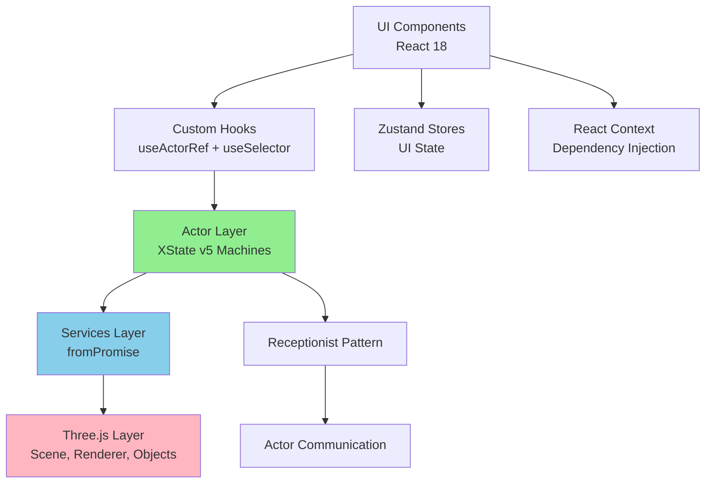

# 📚 F11 - DOCUMENTATION STRATEGY - VISION CIBLE

**Date** : 2 octobre 2025
**Phase** : F - Vision Cible
**Session** : F11 - Stratégie Documentation
**Statut** : ✅ COMPLET

---

## 📋 VUE D'ENSEMBLE

La **stratégie de documentation** définit comment documenter l'architecture, le code, les APIs et les workflows pour faciliter l'onboarding des nouveaux développeurs et la maintenance long-terme.

---

## 📖 DOCUMENTATION LAYERS

```
┌─────────────────────────────────────────────────────────────┐
│                   DOCUMENTATION PYRAMID                     │
├─────────────────────────────────────────────────────────────┤
│                                                             │
│  Level 1: README.md (Quick Start)                           │
│  └─ 5 minutes pour démarrer le projet                       │
│                                                             │
│  Level 2: Architecture Docs (ADRs, Diagrams)                │
│  └─ Comprendre les décisions et la structure                │
│                                                             │
│  Level 3: API Docs (JSDoc, TypeScript)                      │
│  └─ Documentation inline du code                            │
│                                                             │
│  Level 4: Guides (How-to, Tutorials)                        │
│  └─ Ajouter features, débugger, tester                      │
│                                                             │
│  Level 5: Examples (Code samples)                           │
│  └─ Exemples concrets et patterns                           │
│                                                             │
└─────────────────────────────────────────────────────────────┘
```

---

## 📝 LEVEL 1: README.md

### **Root README.md**

```markdown
# Overmind XState v5

> 3D interactive experience built with React 18, XState v5, and Three.js

[](https://github.com/overmind/overmind-xstate/actions)
[](https://codecov.io/gh/overmind/overmind-xstate)
[](LICENSE)

## 🚀 Quick Start

```bash
# Install dependencies
npm install

# Start development server
npm run dev

# Open browser
# http://localhost:3000
```

## 📦 Tech Stack

- **React 18** - UI framework
- **XState v5** - State management (Actor Model)
- **Three.js** - 3D rendering
- **Vite** - Build tool
- **TypeScript** - Type safety
- **Zustand** - UI state (lightweight)
- **Vitest** - Unit testing
- **Playwright** - E2E testing

## 🏗️ Architecture

```
src/
├── actors/          # XState v5 machines (business logic)
├── services/        # fromPromise services (async operations)
├── hooks/           # React hooks (useActorRef + useSelector)
├── components/      # React components (presentation)
├── utils/           # Utilities (easing, receptionist)
└── monitoring/      # Observability (Sentry, Web Vitals)
```

## 📚 Documentation

- [Architecture Overview](docs/architecture/README.md)
- [Getting Started Guide](docs/guides/getting-started.md)
- [API Reference](docs/api/README.md)
- [Contributing Guide](CONTRIBUTING.md)

## 🧪 Testing

```bash
# Unit tests (Vitest)
npm run test

# E2E tests (Playwright)
npm run test:e2e

# Coverage
npm run test:coverage
```

## 🚀 Deployment

```bash
# Build for production
npm run build

# Preview production build
npm run preview
```

## 📄 License

MIT © Overmind Team
```

---

## 🏛️ LEVEL 2: ARCHITECTURE DOCS

### **Architecture Decision Records (ADRs)**

**Structure** :
```
docs/
└── architecture/
    ├── README.md
    ├── adr/
    │   ├── 001-use-xstate-v5.md
    │   ├── 002-actor-model-pattern.md
    │   ├── 003-hybrid-state-management.md
    │   ├── 004-big-bang-deployment.md
    │   └── 005-vercel-hosting.md
    ├── diagrams/
    │   ├── system-architecture.png
    │   ├── actor-ecosystem.png
    │   ├── data-flow.png
    │   └── deployment.png
    └── decisions.md
```

**ADR Template** :
```markdown
# ADR 001: Use XState v5 for State Management

## Status
✅ Accepted

## Context
L'application Overmind nécessite :
- Gestion d'état robuste pour scène Three.js
- 29 animations avec transitions complexes
- Async operations (GLB loading, debouncing)
- Testabilité élevée

## Decision
Utiliser **XState v5** avec **Actor Model** pour business logic.

## Consequences

### Pros ✅
- Type-safety native (TypeScript)
- State machines explicites (no invalid states)
- Async intégré (fromPromise)
- Testabilité (machines isolées)
- Actor Model (découplage via Receptionist)
- Visualisation (Stately Inspector)

### Cons ❌
- Courbe d'apprentissage
- Bundle size +25KB vs Zustand

### Alternatives Considered
1. **Redux Toolkit** - Boilerplate élevé
2. **Zustand** - Pas de state machines
3. **Jotai/Recoil** - Atoms pas adapté

## Implementation

```typescript
export const bloomColorPickerMachine = setup({
  types: {} as {
    context: ColorPickerContext;
    events: ColorPickerEvents;
  }
}).createMachine({
  initial: 'idle',
  states: { /* ... */ }
});
```

## References
- [XState v5 Docs](https://stately.ai/docs/xstate)
- [Actor Model Pattern](https://stately.ai/docs/actors)

## Date
2025-10-02
```

---

### **System Diagrams**

**Architecture Diagram (Mermaid)** :
```markdown
# docs/architecture/diagrams/system-architecture.md

## System Architecture



## Data Flow

```mermaid
sequenceDiagram
    participant User
    participant Component
    participant Hook
    participant Actor
    participant Service
    participant ThreeJS

    User->>Component: Click "Apply Color"
    Component->>Hook: handleColorChange('#ff0000')
    Hook->>Actor: send({ type: 'COLOR_CHANGED', color: 0xff0000 })
    Actor->>Actor: Transition to 'applying'
    Actor->>Service: invoke applyColorToMaterials
    Service->>ThreeJS: setCustomColor(0xff0000)
    ThreeJS-->>Service: Success
    Service-->>Actor: onDone
    Actor->>Actor: Transition to 'applied'
    Actor-->>Hook: useSelector update
    Hook-->>Component: Re-render
    Component-->>User: Visual feedback
```
```

---

## 📘 LEVEL 3: API DOCS (JSDoc + TypeDoc)

### **JSDoc Standards**

```typescript
/**
 * Bloom color picker state machine
 *
 * Manages color selection for bloom effect on IRIS/Eye materials.
 * Applies 200ms debouncing to prevent 92% CPU usage.
 *
 * @remarks
 * This machine is part of the Actor ecosystem and communicates with
 * BloomActor via Receptionist pattern.
 *
 * @example
 * Basic usage:
 * ```typescript
 * const actorRef = useActorRef(bloomColorPickerMachine, {
 *   input: {
 *     securityManager: new SecurityIRISManager(scene),
 *     initialColor: 0xffffff
 *   }
 * });
 * ```
 *
 * @example
 * With callback:
 * ```typescript
 * const actorRef = useActorRef(bloomColorPickerMachine, {
 *   input: {
 *     securityManager,
 *     onApplyColor: (color) => console.log('Applied:', color)
 *   }
 * });
 * ```
 *
 * @see {@link BloomActor} for bloom rendering
 * @see {@link useBloomColorPicker} for React integration
 *
 * @public
 */
export const bloomColorPickerMachine = setup({
  types: {} as {
    /** Machine context */
    context: BloomColorPickerContext;
    /** Machine events */
    events: BloomColorPickerEvents;
  }
}).createMachine({
  /** @internal */
  id: 'bloomColorPicker',
  initial: 'idle',
  states: {
    /**
     * Idle state - waiting for user input
     * @state
     */
    idle: {
      on: {
        COLOR_CHANGED: { target: 'selecting' }
      }
    },
    /**
     * Selecting state - user is choosing color
     * @state
     */
    selecting: {
      on: {
        APPLY_COLOR: { target: 'applying' }
      }
    },
    /**
     * Applying state - color being applied with debounce
     * @state
     */
    applying: {
      invoke: {
        src: applyColorToMaterials,
        onDone: 'applied'
      }
    }
  }
});

/**
 * Load GLB file with DRACO compression
 *
 * @param input - Configuration for GLB loading
 * @param input.path - Path to GLB file (e.g., "/Overmind_V8_27.glb")
 * @param input.dracoLoader - Optional DRACO loader instance
 * @param input.onProgress - Optional progress callback (0-100)
 *
 * @returns Promise resolving to loaded model data
 *
 * @throws {Error} If bone count !== 484
 * @throws {Error} If GLB file not found
 *
 * @example
 * ```typescript
 * const result = await loadGLBFile({
 *   input: {
 *     path: '/Overmind_V8_27.glb',
 *     onProgress: (percent) => console.log(`Loading: ${percent}%`)
 *   }
 * });
 *
 * console.log(result.bones.length); // 484
 * console.log(result.animations.length); // 29
 * ```
 *
 * @public
 */
export const loadGLBFile = fromPromise<GLBLoadOutput, GLBLoadInput>(
  async ({ input }) => {
    // Implementation...
  }
);
```

### **TypeDoc Generation**

**Configuration (typedoc.json)** :
```json
{
  "entryPoints": ["src/index.ts"],
  "out": "docs/api",
  "exclude": ["**/*.test.ts", "**/*.stories.tsx"],
  "excludePrivate": true,
  "excludeProtected": true,
  "excludeInternal": true,
  "readme": "README.md",
  "categoryOrder": [
    "Actors",
    "Services",
    "Hooks",
    "Components",
    "Utils"
  ],
  "plugin": ["typedoc-plugin-markdown"]
}
```

**Generate docs** :
```bash
npm run docs:generate
# Output: docs/api/
```

---

## 📖 LEVEL 4: GUIDES

### **Guide Structure**

```
docs/
└── guides/
    ├── getting-started.md
    ├── adding-new-feature.md
    ├── testing.md
    ├── debugging.md
    ├── performance.md
    ├── deployment.md
    └── troubleshooting.md
```

### **Example Guide: Adding New Feature**

```markdown
# Adding a New Feature

This guide walks you through adding a new feature to Overmind XState.

## 1. Create XState Machine

```bash
npm run plop machine
# Enter name: "particleSystem"
```

This creates:
- `src/actors/particleSystem/particleSystemMachine.ts`
- `src/actors/particleSystem/particleSystemMachine.test.ts`

Edit the machine:

```typescript
export const particleSystemMachine = setup({
  types: {} as {
    context: { particles: THREE.Points[] };
    events: { type: 'CREATE_PARTICLES'; count: number };
  }
}).createMachine({
  initial: 'idle',
  states: {
    idle: {
      on: {
        CREATE_PARTICLES: { target: 'creating' }
      }
    },
    creating: {
      invoke: {
        src: createParticleSystem,
        onDone: 'active'
      }
    }
  }
});
```

## 2. Create Service (if needed)

```typescript
// src/services/createParticleSystem.ts
export const createParticleSystem = fromPromise<Output, Input>(
  async ({ input }) => {
    // Implementation
  }
);
```

## 3. Create React Hook

```bash
npm run plop hook
# Enter name: "useParticleSystem"
```

```typescript
export function useParticleSystem() {
  const actorRef = useActorRef(particleSystemMachine);
  const particles = useSelector(actorRef, (state) => state.context.particles);

  const createParticles = useCallback((count: number) => {
    actorRef.send({ type: 'CREATE_PARTICLES', count });
  }, [actorRef]);

  return { particles, createParticles };
}
```

## 4. Create Component

```bash
npm run plop component
# Enter name: "ParticleControl"
```

## 5. Write Tests

```typescript
// particleSystemMachine.test.ts
describe('particleSystemMachine', () => {
  it('should create particles', async () => {
    const actor = createActor(particleSystemMachine);
    actor.start();

    actor.send({ type: 'CREATE_PARTICLES', count: 1000 });

    await waitFor(actor, (state) => state.matches('active'));
    expect(actor.getSnapshot().context.particles).toHaveLength(1000);
  });
});
```

## 6. Register in Receptionist

```typescript
// src/actors/application/applicationMachine.ts
actions: {
  registerActors: ({ system }) => {
    const receptionist = system.get('receptionist');
    receptionist.register('particleSystem', particleSystemActorRef);
  }
}
```

## 7. Update Documentation

- Add JSDoc to machine
- Update architecture diagram
- Add example to guides
- Create ADR if architectural decision

Done! Your feature is now integrated.
```

---

## 💡 LEVEL 5: EXAMPLES

### **Example Structure**

```
docs/
└── examples/
    ├── bloom-color-picker/
    │   ├── README.md
    │   ├── machine.ts
    │   ├── hook.ts
    │   └── component.tsx
    ├── animation-control/
    ├── debug-panel/
    └── particle-system/
```

### **Example: Bloom Color Picker**

```markdown
# Bloom Color Picker Example

Complete example of implementing a color picker feature.

## Files

- `machine.ts` - XState machine
- `service.ts` - fromPromise service
- `hook.ts` - React hook
- `component.tsx` - React component

## Live Demo

[Open in StackBlitz](https://stackblitz.com/edit/overmind-bloom-color-picker)

## Code

### Machine
```typescript
export const bloomColorPickerMachine = setup({
  // ... (code complet)
});
```

### Hook
```typescript
export function useBloomColorPicker() {
  // ... (code complet)
}
```

### Component
```typescript
export function BloomColorPicker() {
  // ... (code complet)
}
```

## Usage

```typescript
import { BloomColorPicker } from './components/BloomColorPicker';

function App() {
  return (
    <OvermindProvider>
      <BloomColorPicker />
    </OvermindProvider>
  );
}
```
```

---

## 🔄 DOCUMENTATION AUTOMATION

### **Auto-generate from Code**

**Markdown from JSDoc** :
```bash
npm install --save-dev jsdoc-to-markdown

# Generate
jsdoc2md src/**/*.ts > docs/api/auto-generated.md
```

**Diagrams from Code (Mermaid)** :
```typescript
// Generate actor diagram from code
import { extractActors } from './tools/extract-actors';

const actors = extractActors('./src/actors');

console.log(`
\`\`\`mermaid
graph TB
${actors.map(a => `  ${a.id}[${a.name}]`).join('\n')}
${actors.flatMap(a => a.children.map(c => `  ${a.id} --> ${c}`)).join('\n')}
\`\`\`
`);
```

---

## 📚 DOCUMENTATION HOSTING

### **Docusaurus Setup**

**Installation** :
```bash
npx create-docusaurus@latest docs classic
cd docs
npm run start
```

**Structure** :
```
docs/
├── docs/
│   ├── intro.md
│   ├── architecture/
│   ├── guides/
│   └── api/
├── blog/
│   ├── 2025-10-02-launch.md
│   └── 2025-11-01-v2-release.md
├── src/
│   └── pages/
│       └── index.tsx
└── docusaurus.config.js
```

**Deploy to Vercel** :
```bash
vercel --prod
# → https://docs.overmind.app
```

---

## ✅ CHECKLIST DOCUMENTATION

- [ ] README.md (Quick Start)
- [ ] Architecture docs (ADRs)
- [ ] System diagrams (Mermaid)
- [ ] JSDoc on all public APIs
- [ ] TypeDoc auto-generation
- [ ] Getting Started guide
- [ ] Adding Feature guide
- [ ] Testing guide
- [ ] Debugging guide
- [ ] Performance guide
- [ ] Deployment guide
- [ ] Troubleshooting guide
- [ ] Code examples (5+ examples)
- [ ] API reference (TypeDoc)
- [ ] Docusaurus website
- [ ] Documentation hosting (Vercel)
- [ ] Documentation CI (auto-build)

---

**Prochaine** : F12 Evolution Roadmap

